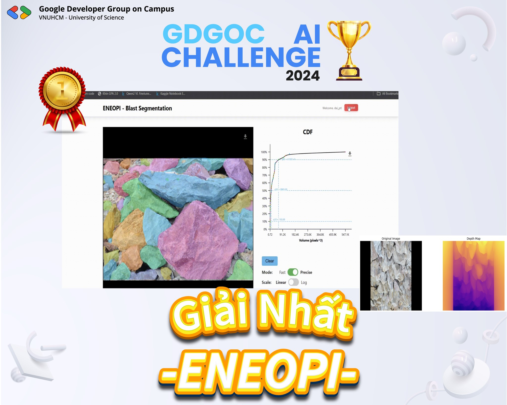

# ENEOPI Fragment Segmentation Project (GDGoC-AIC)

An advanced AI-powered system for automated segmentation and volume estimation of fragments in images, featuring dual processing modes (RGB and RGB-D) with user authentication and a modern web interface.

## 🎥 Demo


## 🎉 Result


[Facebook Post](https://www.facebook.com/share/p/19jvpozVKt/)

> Some thoughts:
> + Thanks GDGoC for the opportunity to participate in this competition. I learned a lot from this contest!
> + I'm grateful for the support from the GDGoC team, especially [Mentor Duc](https://beacons.ai/bmd1905) for his guidance and support.
> + Thanks [Bui Huy Giap](https://github.com/ziap), Duy Hung and Nam Anh for 3 month collaboration!
## 🚀 Project Overview

This repository consists of two main components that work together to provide a complete fragment segmentation solution:

1. **Segmentation Server (`/server`)**: A production-ready FastAPI backend with JWT authentication, OAuth support, and dual segmentation modes
2. **Model Training (`/model`)**: Comprehensive training pipeline for YOLOv8 segmentation models and depth estimation integration

## ✨ Key Features

### 🔐 Authentication & Security
- **JWT-based Authentication** with secure token management
- **OAuth Integration** (Google Sign-In support)
- **User Registration & Login** with email validation
- **Password Security** using bcrypt hashing
- **Session Management** with token expiration

### 🖼️ Image Processing Capabilities
- **Dual Segmentation Modes:**
  - **Fast Mode (RGB)**: Lightning-fast processing using optimized YOLO ONNX models
  - **Precise Mode (RGB-D)**: Enhanced accuracy with depth information via Depth Anything V2
- **Volume Estimation**: Advanced 3D volume calculation using point cloud analysis
- **Real-time Processing**: Efficient ONNX runtime inference
- **Multiple Format Support**: JPEG, PNG image processing

### 🌐 Modern Web Interface
- **Responsive Design**: Beautiful, mobile-friendly user interface
- **Real-time Feedback**: Live processing status and results display
- **Drag & Drop Upload**: Intuitive file upload experience
- **Result Visualization**: Interactive display of segmented images and volume data

### 🛠️ Technical Stack

**Backend Technologies:**
- FastAPI (Modern Python web framework)
- SQLAlchemy (Database ORM)
- JWT & OAuth (Authentication)
- ONNX Runtime (Model inference)
- OpenCV (Image processing)
- PyTorch (Deep learning)

**Frontend Technologies:**
- HTML5/CSS3/JavaScript
- Modern UI/UX design patterns
- Responsive layout system

**AI/ML Technologies:**
- YOLOv8 Segmentation (RGB & RGB-D variants)
- Depth Anything V2 (Monocular depth estimation)
- Point Cloud Processing (3D volume calculation)
- ONNX Model Optimization

## 📁 Project Structure

```css
├── server/                 # Production FastAPI server
│   ├── app.py             # Main application entry point
│   ├── model.py           # Core segmentation logic
│   ├── config.py          # Configuration management
│   ├── auth/              # Authentication system
│   ├── frontend/          # Web interface files
│   ├── utils/             # Utility modules
│   ├── docker/            # Docker deployment files
│   └── weights/           # Pre-trained model weights
├── model/                 # Training pipeline
│   ├── *.ipynb           # Jupyter training notebooks
│   ├── script/           # Training scripts
│   └── depth_estimation/ # Depth model utilities
└── README.md             # This file
```

## 🚀 Quick Start

### Prerequisites
- Python 3.9+
- Docker & Docker Compose (recommended)
- Model weights (see setup instructions)

### 🐳 Docker Deployment (Recommended)

1. **Clone the repository:**
  
   ```bash
   git clone <repository-url>
   cd <this repository>
   ```

2. **Download model weights:**
   - Download from: [EnEoPi Weights](https://drive.google.com/drive/folders/1REDe3jkkYV856jkzJiQ5LFVdSxQ5qXeQ?usp=sharing)
   - Create weights directory and place files:

     ```bash
     mkdir -p server/weights
     ```

   - Place downloaded files in `server/weights/`:
     - `yolo_rgb_nano.onnx`
     - `yolo_rgbd_nano.onnx`
     - `depth_anything_v2_vits.pth`

3. **Configure environment:**
  
   ```bash
   cd server
   cp .env_example .env
   # Edit .env file with your configuration
   ```

4. **Deploy with Docker:**
  
   ```bash
   cd server/docker
   docker-compose up -d --build
   ```

5. **Access the application:**
   - Open <http://localhost:3000>
   - Register a new account or sign in
   - Start segmenting images!

### 🐍 Local Development

```bash
cd server
python -m venv venv
source venv/bin/activate  # On Windows: venv\Scripts\activate
pip install -r requirements.txt
python app.py
```

## 📖 Documentation

For detailed information on each component:

- **[Server Documentation](./server/README.md)**: Complete setup, API reference, authentication, and deployment guide
- **[Model Training Guide](./model/README.md)**: Training procedures, model architectures, and reproduction instructions

## 🔗 API Endpoints

### Authentication
- `POST /auth/register` - User registration
- `POST /auth/login` - User login
- `GET /auth/me` - Get current user info
- `POST /auth/oauth/google` - Google OAuth login

### Core Functionality
- `GET /` - Web interface (requires authentication)
- `POST /predict` - Image segmentation endpoint
  - Parameters: `file` (image), `use_depth` ("fast"/"precise")
  - Returns: Segmented image, volumes, processing time

## 🤝 Contributing

We welcome contributions! Please see our contributing guidelines and feel free to submit issues or pull requests.
